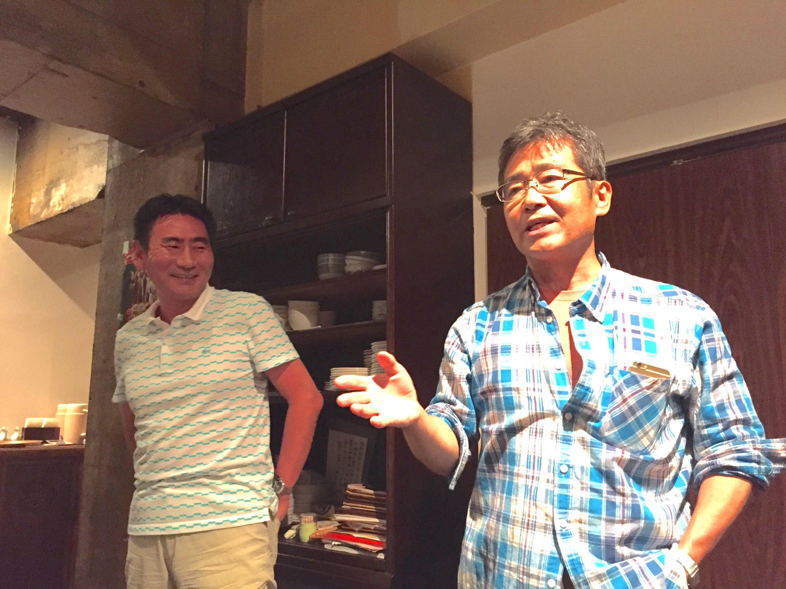
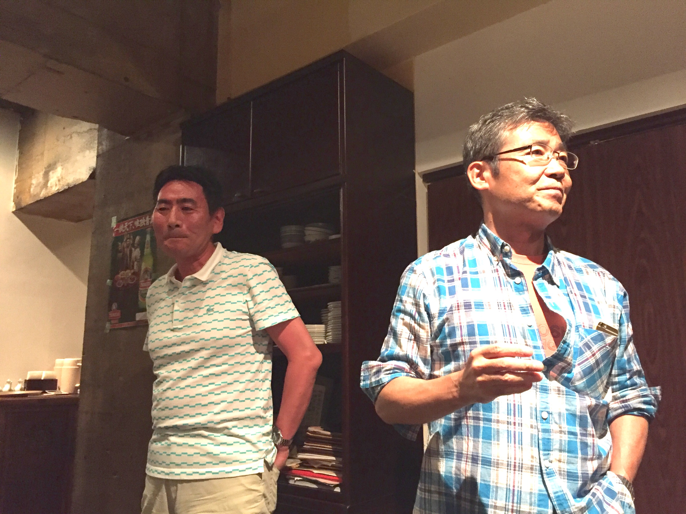
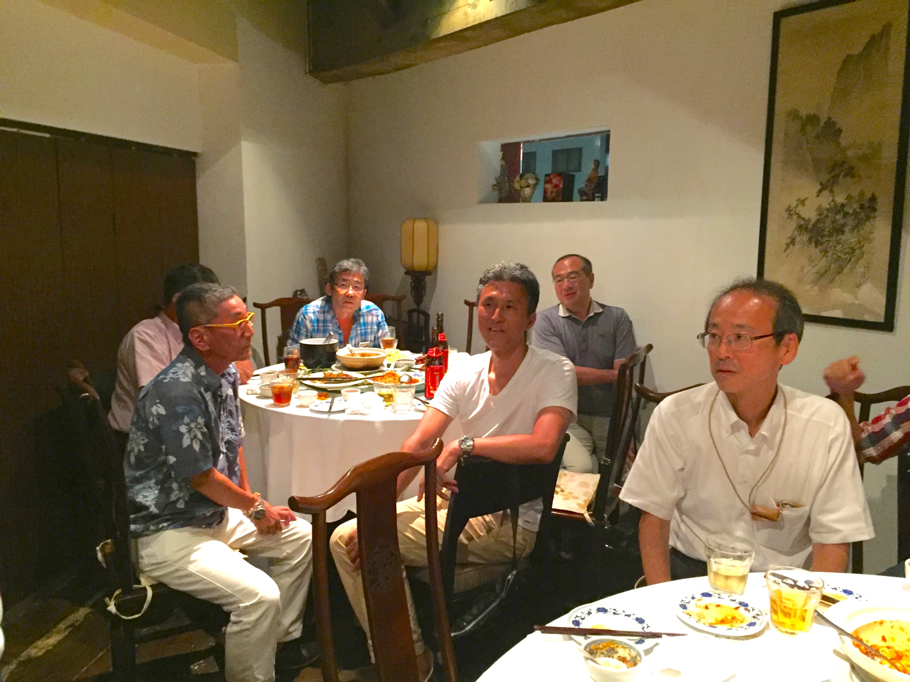
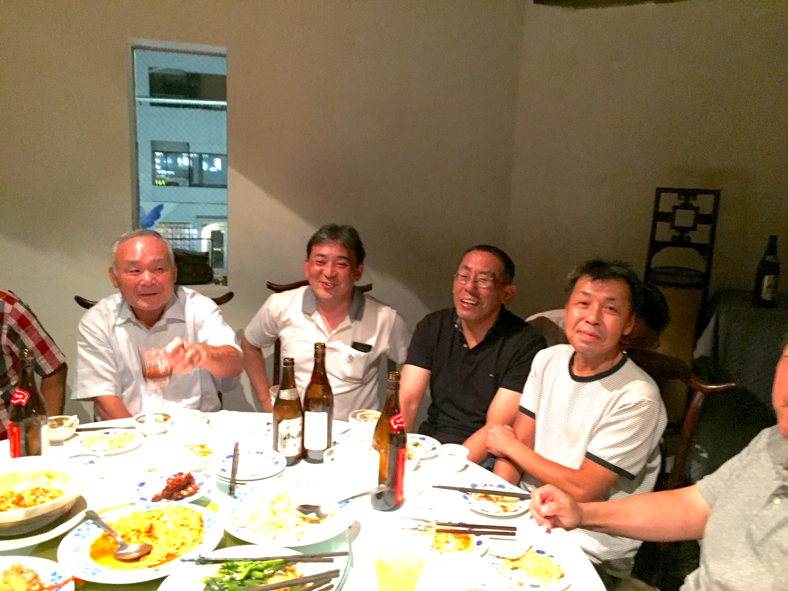
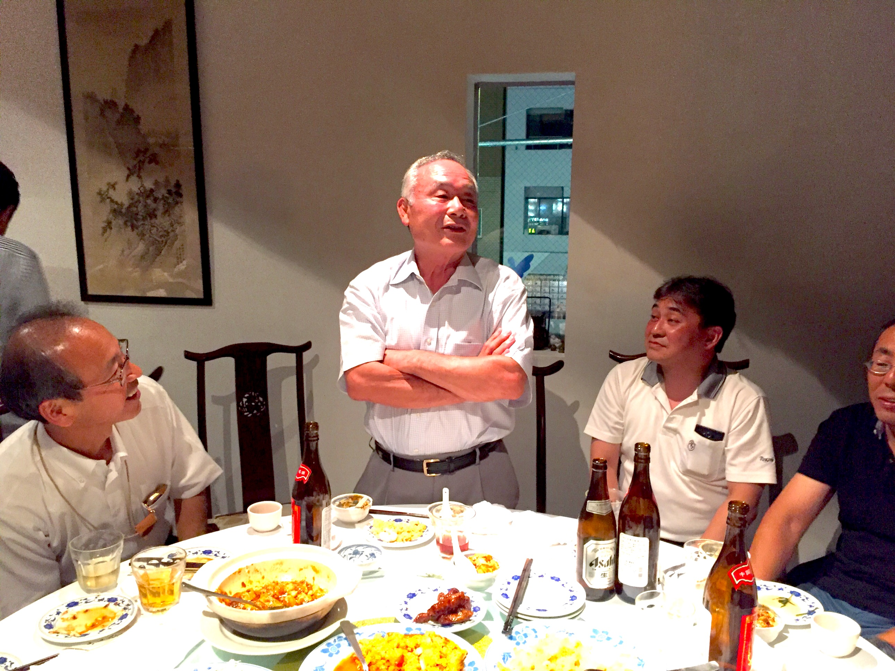
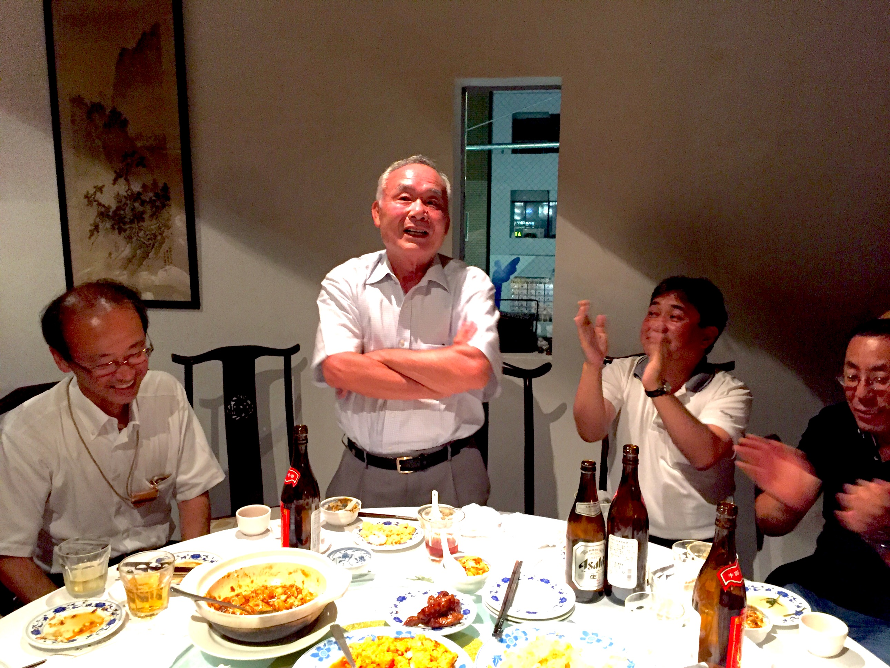
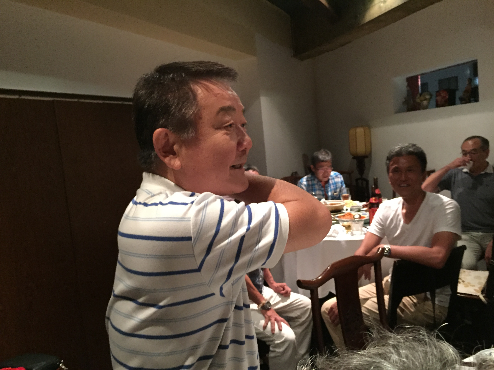
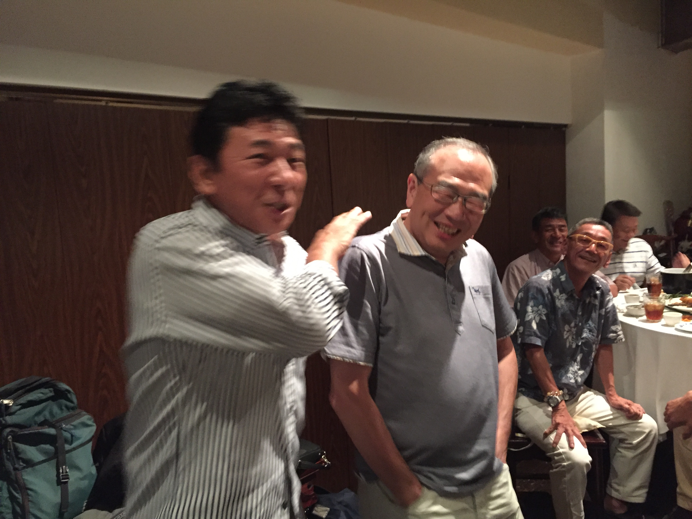

# ooizumi_judo
<html lang="ja">
 <head>
  <meta charset="utf-8" />
	 

<link href="https://cdnjs.cloudflare.com/ajax/libs/lightbox2/2.7.1/css/lightbox.css" rel="stylesheet">
 
</head>
<body>
<h1><marquee behavior="left">!!! 東京都立大泉高校、柔道部OB会の記録 !!!</marquee></h1>

<marquee direction="right" scrollamount="20" width="30%">(^_^)/~hada</marquee>

                             
<h1><marquee behavior="left">!!! 2017年8月12日(土)、OB会＠中華料理ロバーツ !!!</marquee></h1>

<h3>画像はクリックで拡大します。スライドショーで閲覧できます。 最後の一枚のみ動画です。別途クリック願います！</h3>

 
  
中華料理ロバーツ　住所/渋谷区千駄ヶ谷5-21-6　2階　電話/03-5269-0045 
<a href="https://tabelog.com/tokyo/A1304/A130403/13004119/" target="_blank">中華料理ロバーツHP</a>
                             

  

<!-- フッタ -->
 <footer>
 Copyright 2018/09/28 S.Hada
 </footer>
